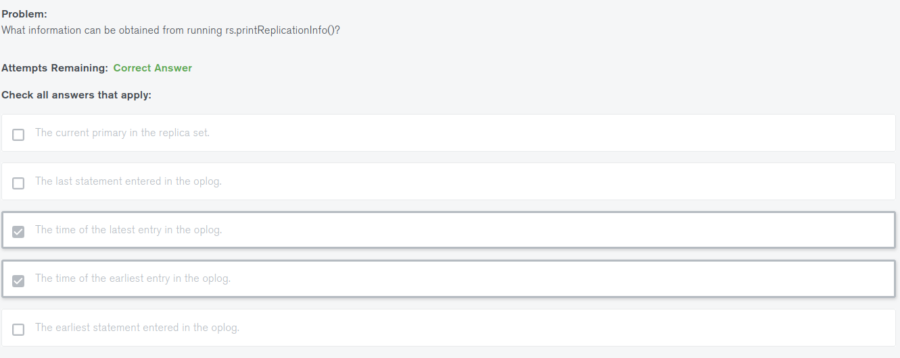

# MongoDB University M103 学习笔记

## Chapter 0：介绍 & 环境安装


### 什么是vagrant？

vagrant是一个工具，用于创建和部署虚拟化开发环境的。

拿VirtualBox举例，VirtualBox会开放一个创建虚拟机的接口，Vagrant会利用这个接口创建虚拟机，并且通过Vagrant来管理，配置和自动安装虚拟机。


### vagrant 常见命令

| 命令               | 解释              |
| ------------------ | ----------------- |
| vagrant box list   | 查看目前已有的box |
| vagrant box add    | 新增加一个box     |
| vagrant box remove | 删除指定box       |
| vagrant box remove| 删除指定box |
| vagrant init| 初始化配置vagrantfile |
| vagrant up| 启动虚拟机 |
| vagrant ssh| ssh登录虚拟机 |
| vagrant suspend| 挂起虚拟机 |
| vagrant reload| 重启虚拟机 |
| vagrant halt| 关闭虚拟机 |
| vagrant status| 查看虚拟机状态 |
| vagrant destroy| 删除虚拟机 |


<https://www.vagrantup.com/downloads.html>

```bash
sudo apt install vagrant

vagrant --version

# 安装 ubuntu/trusty64 虚拟机
# http://www.codebind.com/linux-tutorials/install-vagrant-ubuntu-16-04/
$ vagrant box add ubuntu/trusty64

```


```bash
# 启动虚拟机
cd ~/m103/m103-vagrant-env/
vagrant up --provision

# 启动后可以看到 virtualbox 的进程
ps -ef | grep VBox

# 连接虚拟机
vagrant ssh

# 退出虚拟机
exit

# 停止虚拟机
vagrant halt

```

> 连接虚拟机用户名，密码
>
> Username: vagrant
> Password: vagrant


```bash
# 查看虚拟机IP,前提 ssh 已链接到虚拟机
ping m103
```


## Chapter 1： Mongod

### 启动 Mongod

```bash
# 启动 mongo 服务
mognod

# 连接 mongoDB
mongo
db.createCollection("employees")
use admin
db.shutdownServer()
exit
# 这种方式启动的 mongod 数据文件默认存储 /data/db/
# 这种方式启动 mongod 监听端口 27017
```


```bash
# mongod 帮助文档
mongod --help


# 指定 mongod 服务数据库存储路径
mongod --dbpath <directory path>

# 指定 mongod 服务启动时监听的端口
mongod --port <port number>

# 设置 mongo 数据库需要授权链接
mongod --auth

# 设置 mongo 可连接的ip地址（ip 可配置多个）
mongod --bind_ip 123.123.123.123
mongod --bind_ip localhost,123.123.123.123
```


默认情况下， mongod 启用授权但没有配置用户时允许通过 localhost 连接。

```bash
mongod --dbpath=/data/db/ --port=27000 --bind_ip=192.168.103.100,localhost --auth --fork


# 查看 mongod 进程
ps -ef | grep mongod

```


```bash
# 在 admin 库上创建 root 角色 "m103-admin" 用户，密码  m103-pass
mongo admin --host localhost:27000 --eval '
  db.createUser({
    user: "m103-admin",
    pwd: "m103-pass",
    roles: [
      {role: "root", db: "admin"}
    ]
  })
'
```


```bash
# 登陆验证授权
mongo 127.0.0.1:27000/admin
db.auth('m103-admin', 'm103-pass')
```


### Mongod 配置文件

```bash
mongod --dbpath /data/db --logpath /data/log/mongod.log --fork --replSet "M103" --keyFile /data/keyfile --bind_ip "127.0.0.1,192.168.103.100" --tlsMode requireTLS --tlsCAFile "/etc/tls/TLSCA.pem" --tlsCertificateKeyFile "/etc/tls/tls.pem"
```

等价的配置文件：

```yaml
storage:
  dbPath: "/data/db"
systemLog:
  path: "/data/log/mongod.log"
  destination: "file"
replication:
  replSetName: M103
net:
  port: 27017
  bindIp : "127.0.0.1,192.168.103.100"
tls:
  mode: "requireTLS"
  certificateKeyFile: "/etc/tls/tls.pem"
  CAFile: "/etc/tls/TLSCA.pem"
security:
  keyFile: "/data/keyfile"
processManagement:
  fork: true
```

示例配置：

```yaml
storage:
  dbPath: "/var/mongodb/db"
systemLog:
  destination: file
  path: "/var/mongodb/db/mongod.log"
  logAppend: true
net:
  port: 27000
  bindIp: "127.0.0.1,192.168.103.100"
security:
  authorization: enabled
operationProfiling:
  mode: slowOp
  slowOpThresholdMs: 50
  slowOpSampleRate: 1
processManagement:
  fork: true
```

官网参考： <https://docs.mongodb.com/v3.6/reference/configuration-options/>


### Mongod 文件结构

```bash
# mongod --dbpath 指定的数据库存储了路径
ls -l /data/db

# mongod 诊断数据目录
ls -l /data/db/diagnostic.data

# mongod journal 目录
ls -l /data/db/journal

# mongod socket 文件
ls /tmp/mongodb-27017.sock
```


### Mongo 基础命令

```js
// 用户命令
db.createUser()
db.dropUser()

// 集合命令
db.<collection>.renameCollection()
db.<collection>.createIndex()
db.<collection>.drop()

// 数据库命令
db.dropDatabase()
db.createCollection()

// 数据库命令行为集合创建索引
db.runCommand(
  { "createIndexes": <collection> },
  { "indexes": [
    {
      "key": { "product": 1 }
    },
    { "name": "name_index" }
    ]
  }
)

// 为集合创建索引
db.<collection>.createIndex(
  { "product": 1 },
  { "name": "name_index" }
)
```


### Mongod 日志

```bash
// 查看当前配置的日志组件的详细程度
mongo admin --host 192.168.103.100:27000 -u m103-admin -p m103-pass --eval '
  db.getLogComponents()
'

//　修改日志级别，数字越高，调试消息越详细，-1表示日志组件从其父级继承其详细级别,默认0 
mongo admin --host 192.168.103.100:27000 -u m103-admin -p m103-pass --eval '
  db.setLogLevel(0, "index")
'

//  通过Mongo shell查看日志 (必需使用 admin 库执行)
db.adminCommand({ "getLog": "global" })

// 　通过命令行查看日志
tail -f /data/db/mongod.log
```


### 分析数据库

```bash
// 列出所有的集合名,  ’show collections‘ 后期版本不再显示
db.runCommand({listCollections: 1})

// 获取分析级别设置
mongo newDB --host 192.168.103.100:27000 -u m103-admin -p m103-pass --authenticationDatabase admin --eval '
  db.getProfilingLevel()
'

// 修改分析级别设置，命令行执行会在程序重启后丢失,可使用　operationProfiling　启动参数保存配置
mongo newDB --host 192.168.103.100:27000 -u m103-admin -p m103-pass --authenticationDatabase admin --eval '
  db.setProfilingLevel(1)
'

// 修改分级级别设置慢操作毫秒阈值
mongo newDB --host 192.168.103.100:27000 -u m103-admin -p m103-pass --authenticationDatabase admin --eval '
  db.setProfilingLevel( 1, { slowms: 100 } )
'

//　显示所有的集合名称
mongo newDB --host 192.168.103.100:27000 -u m103-admin -p m103-pass --authenticationDatabase admin --eval '
  db.getCollectionNames()
'
```


### 基本安全性：第一部分


### 基本安全性：第二部分

### 内置角色： 第一部分

### 内置角色： 第二部分

```js
// 创建安全员用户
db.createUser(
  { user: "security_officer",
    pwd: "h3ll0th3r3",
    roles: [ { db: "admin", role: "userAdmin" } ]
  }
)

// 创建数据库超级管理员用户
db.createUser(
  { user: "dba",
    pwd: "c1lynd3rs",
    roles: [ { db: "admin", role: "dbAdmin" } ]
  }
)


// 授予角色给用户
db.grantRolesToUser( "dba",  [ { db: "playground", role: "dbOwner"  } ] )

// 查看角色的特权
db.runCommand( { rolesInfo: { role: "dbOwner", db: "playground" }, showPrivileges: true} )
```


### 服务工具概述

```bash
# 搜索出 mongo 的一些文件
find /usr/bin/ -name "mongo*"


# 创建一个新的数据库路径并启动mongod
mkdir -p ~/first_mongod
mongod --port 30000 --dbpath ~/first_mongod --logpath ~/first_mongod/mongodb.log --fork


# 使用mongodump获取MongoDB集合的BSON转储
mongodump --help
mongodump --port 30000 --db applicationData --collection products
ls dump/applicationData/
cat dump/applicationData/products.metadata.json


# 使用mongorestore从BSON转储中还原MongoDB集合
mongorestore --drop --port 30000 dump/


# 使用mongoexport将MongoDB集合导出为JSON或CSV（或stdout）
mongoexport --help
mongoexport --port 30000 --db applicationData --collection products
mongoexport --port 30000 --db applicationData --collection products -o products.json


# 使用mongoimport从JSON或CSV文件创建MongoDB集合：
mongoimport --port 30000 products.json
```


```bash
# Mongodump可以创建一个数据文件和一个元数据文件，但是mongoexport只是创建一个数据文件 
# 如果只指定了 db 没有指定 collection 则 dump 出整个数据库
mongodump --port=27000 --username=m103-application-user --password=m103-application-pass --authenticationDatabase=admin  --db=applicationData --collection=products


mongoexport --port=27000 --username=m103-application-user --password=m103-application-pass --authenticationDatabase=admin  --db=applicationData --collection=products


mongoimport --port=27000 --username=m103-application-user --password=m103-application-pass --authenticationDatabase=admin  --db=applicationData --collection=products  --file /dataset/products.json


```


## Chapter 2:  Replication

### 设置复制集

创建第一个节点的配置文件（node1.conf）：

```yaml
storage:
  dbPath: /var/mongodb/db/node1
net:
  bindIp: 192.168.103.100,localhost
  port: 27011
security:
  authorization: enabled
  keyFile: /var/mongodb/pki/m103-keyfile
systemLog:
  destination: file
  path: /var/mongodb/db/node1/mongod.log
  logAppend: true
processManagement:
  fork: true
replication:
  replSetName: m103-example
```

创建秘钥文件并为其设置相应权限：

```bash
sudo mkdir -p /var/mongodb/pki/
sudo chown vagrant:vagrant /var/mongodb/pki/
openssl rand -base64 741 > /var/mongodb/pki/m103-keyfile
chmod 400 /var/mongodb/pki/m103-keyfile
```

创建 node1 节点的数据文件：

```bash
mkdir -p /var/mongodb/db/node1
```

创建node2.cong ， node3.conf 配置文件（参考node1.conf 修改 dbpath, port, logpath）:

```yaml
storage:
  dbPath: /var/mongodb/db/node2
net:
  bindIp: 192.168.103.100,localhost
  port: 27012
security:
  keyFile: /var/mongodb/pki/m103-keyfile
systemLog:
  destination: file
  path: /var/mongodb/db/node2/mongod.log
  logAppend: true
processManagement:
  fork: true
replication:
  replSetName: m103-example
```

```yaml
storage:
  dbPath: /var/mongodb/db/node3
net:
  bindIp: 192.168.103.100,localhost
  port: 27013
security:
  keyFile: /var/mongodb/pki/m103-keyfile
systemLog:
  destination: file
  path: /var/mongodb/db/node3/mongod.log
  logAppend: true
processManagement:
  fork: true
replication:
  replSetName: m103-example
```

常见 node2, node3 节点的数据库文件：

```bash
mkdir /var/mongodb/db/{node2,node3}
```

启动 3 个节点 mongod 服务：

```bash
mongod -f node1.conf
mongod -f node2.conf
mongod -f node3.conf
```

连接到 node1 节点：

```bash
mongo --port 27011
```

初始化复制， 创建用户：

```js
rs.initiate()

use admin
db.createUser({
  user: "m103-admin",
  pwd: "m103-pass",
  roles: [
    {role: "root", db: "admin"}
  ]
})
```

 退出当前 Mongo shell 连接进入复制集：

```bash
exit
mongo --host "m103-example/192.168.103.100:27011" -u "m103-admin" -p "m103-pass" --authenticationDatabase "admin"
```


```bash
# 查看复制集状态信息：
rs.status()

# 添加复制集其他成员
rs.add("m103:27012")
rs.add("m103:27013")

# 查看当前复制集拓扑图概览
rs.isMaster()

# 退下当前主节点
rs.stepDown()

# 重新查看主节点退下后，重新选举后的副本集概览
rs.isMaster()
```


```bash
rs.status()

rs.isMaster()

db.serverStatus()['repl']

rs.printReplicationInfo()
```




## Chapter 3:  Sharding

### 设置分片集群

Config Server 节点配置文件 csrs_1.conf:

```yaml
sharding:
  clusterRole: configsvr
storage:
  dbPath: /var/mongodb/db/csrs1
net:
  bindIp: localhost,192.168.103.100
  port: 26001
security:
  keyFile: /var/mongodb/pki/m103-keyfile
systemLog:
  destination: file
  path: /var/mongodb/db/csrs1.log
  logAppend: true
processManagement:
  fork: true
replication:
  replSetName: m103-csrs
```

csrs_2.conf

```yaml
sharding:
  clusterRole: configsvr
replication:
  replSetName: m103-csrs
security:
  keyFile: /var/mongodb/pki/m103-keyfile
net:
  bindIp: localhost,192.168.103.100
  port: 26002
systemLog:
  destination: file
  path: /var/mongodb/db/csrs2.log
  logAppend: true
processManagement:
  fork: true
storage:
  dbPath: /var/mongodb/db/csrs2
```

csrs_3.conf:

```yaml
sharding:
  clusterRole: configsvr
replication:
  replSetName: m103-csrs
security:
  keyFile: /var/mongodb/pki/m103-keyfile
net:
  bindIp: localhost,192.168.103.100
  port: 26003
systemLog:
  destination: file
  path: /var/mongodb/db/csrs3.log
  logAppend: true
processManagement:
  fork: true
storage:
  dbPath: /var/mongodb/db/csrs3
```

启动以上 3 个 Config Server 节点:

```bash
mongod -f csrs_1.conf
mongod -f csrs_2.conf
mongod -f csrs_3.conf
```

启动出现如下失败信息,检查 logpath, dbpath 路径是不是都存在
```bash
vagrant@m103:~$ mongod -f csrs_1.conf 
about to fork child process, waiting until server is ready for connections.
forked process: 2351
ERROR: child process failed, exited with error number 51
To see additional information in this output, start without the "--fork" option.
```

连接到 Config Server 节点:

```bash
mongo --port 26001
```

初始化配置配置节点副本集:

```js
var config = {
    _id: "m103-csrs",
    members: [
        {_id: 0, host: "192.168.103.100:26001"},
        {_id: 1, host: "192.168.103.100:26002"},
        {_id: 2, host: "192.168.103.100:26003"},
    ]
}
rs.initiate(config)
```

在副本集上创建超级用户:

```js
use admin
db.createUser({
  user: "m103-admin",
  pwd: "m103-pass",
  roles: [
    {role: "root", db: "admin"}
  ]
})
```

验证创建的超级用户:

```js
db.auth("m103-admin", "m103-pass")
```


Mongos config (mongos.conf) :

```yaml
sharding:
  configDB: m103-csrs/192.168.103.100:26001,192.168.103.100:26002,192.168.103.100:26003
security:
  keyFile: /var/mongodb/pki/m103-keyfile
net:
  bindIp: localhost,192.168.103.100
  port: 26000
systemLog:
  destination: file
  path: /var/mongodb/db/mongos.log
  logAppend: true
processManagement:
  fork: true
```

启动 mongos 节点:

```bash
mongos -f mongos.conf 
```

连接到 mongos :

```bash
mongo --port 26000 --username m103-admin --password m103-pass --authenticationDatabase admin
```

检查分片状态:

```bash
MongoDB Enterprise mongos> sh.status()
```

更新 node1.conf: 

```yaml
sharding:
  clusterRole: shardsvr
storage:
  dbPath: /var/mongodb/db/node1
  wiredTiger:
    engineConfig:
      cacheSizeGB: .1
net:
  bindIp: 192.168.103.100,localhost
  port: 27011
security:
  keyFile: /var/mongodb/pki/m103-keyfile
systemLog:
  destination: file
  path: /var/mongodb/db/node1/mongod.log
  logAppend: true
processManagement:
  fork: true
replication:
  replSetName: m103-repl
```

更新 node2.conf: 

```yaml
sharding:
  clusterRole: shardsvr
storage:
  dbPath: /var/mongodb/db/node2
  wiredTiger:
    engineConfig:
      cacheSizeGB: .1
net:
  bindIp: 192.168.103.100,localhost
  port: 27012
security:
  keyFile: /var/mongodb/pki/m103-keyfile
systemLog:
  destination: file
  path: /var/mongodb/db/node2/mongod.log
  logAppend: true
processManagement:
  fork: true
replication:
  replSetName: m103-repl
```

更新 node3.conf: 

```yaml
sharding:
  clusterRole: shardsvr
storage:
  dbPath: /var/mongodb/db/node3
  wiredTiger:
    engineConfig:
      cacheSizeGB: .1
net:
  bindIp: 192.168.103.100,localhost
  port: 27013
security:
  keyFile: /var/mongodb/pki/m103-keyfile
systemLog:
  destination: file
  path: /var/mongodb/db/node3/mongod.log
  logAppend: true
processManagement:
  fork: true
replication:
  replSetName: m103-repl
```

直接连接到从节点上:

```bash
mongo --port 27012 -u "m103-admin" -p "m103-pass" --authenticationDatabase "admin"
```

停掉节点:

```bash
use admin
db.shutdownServer()
```

新配置方式重启节点:

```bash
mongod -f node2.conf
```

停掉当前主节点:

```bash
rs.stepDown()
```

在 mongos 添加一个新的分片集群:

```bash
sh.addShard("m103-repl/192.168.103.100:27012")
```


### 配置DB

切换到配置db

```
use config
```


```js
db.databases.find().pretty()

db.collections.find().pretty()

db.shards.find().pretty()

db.shards.find().pretty()

db.chunks.find().pretty()

db.mongos.find().pretty()
```


### 片键

显示 m103 数据库集合

```bash
use m103
show collections
```

开启 m103 数据库分片

```js
sh.enableSharding("m103")
```

products 集合中查取一条文档数据, 帮助我选择片键:

```js
db.products.findOne()
```

创建索引:

```js
db.products.createIndex( { "sku" : 1 } )
```

products 集合使用 sku 作为片键:

```
sh.shardCollection("m103.products", {"sku" : 1 } )
```

检查分片集群的状态:

```js
sh.status()
```


### 在集合上做分片

创建 3 个节点 的  m103-repl-2 的副本就做分片.

先创建节点的数据库文件:

```
mkdir /var/mongodb/db/{4,5,6}
```

节点4 ( node3.conf)

```yaml
storage:
  dbPath: /var/mongodb/db/4
  wiredTiger:
     engineConfig:
        cacheSizeGB: .1
net:
  bindIp: 192.168.103.100,localhost
  port: 27004
security:
  keyFile: /var/mongodb/pki/m103-keyfile
systemLog:
  destination: file
  path: /var/mongodb/db/4/mongod.log
  logAppend: true
processManagement:
  fork: true
operationProfiling:
  slowOpThresholdMs: 50
replication:
  replSetName: m103-repl-2
sharding:
  clusterRole: shardsvr
```

节点5 (node5.conf)

```yaml
storage:
  dbPath: /var/mongodb/db/5
  wiredTiger:
     engineConfig:
        cacheSizeGB: .1
net:
  bindIp: 192.168.103.100,localhost
  port: 27005
security:
  keyFile: /var/mongodb/pki/m103-keyfile
systemLog:
  destination: file
  path: /var/mongodb/db/5/mongod.log
  logAppend: true
processManagement:
  fork: true
operationProfiling:
  slowOpThresholdMs: 50
replication:
  replSetName: m103-repl-2
sharding:
  clusterRole: shardsvr
```

节点 6 (node6.conf)

```yaml
storage:
  dbPath: /var/mongodb/db/6
  wiredTiger:
     engineConfig:
        cacheSizeGB: .1
net:
  bindIp: 192.168.103.100,localhost
  port: 27006
security:
  keyFile: /var/mongodb/pki/m103-keyfile
systemLog:
  destination: file
  path: /var/mongodb/db/6/mongod.log
  logAppend: true
processManagement:
  fork: true
operationProfiling:
  slowOpThresholdMs: 50
replication:
  replSetName: m103-repl-2
sharding:
  clusterRole: shardsvr
```

初始化 m103-repl-2 副本集:

```js
var config = {
    _id: "m103-repl-2",
    members: [
        {_id: 0, host: "m103:27004"},
        {_id: 1, host: "m103:27005"},
        {_id: 2, host: "m103:27006"},
    ]
}
rs.initiate(config)


// 创建用户
use admin
db.createUser({
  user: "m103-admin",
  pwd: "m103-pass",
  roles: [
    {role: "root", db: "admin"}
  ]
})
```

连接到 mongos 将 m103-repl-2 副本集作为分片添加进去:

```js
sh.addShard("m103-repl-2/m103:27004")
```

导入数据到主分片上:

```bash
mongoimport --drop /dataset/products.json --port 26000 -u "m103-admin" \
-p "m103-pass" --authenticationDatabase "admin" \
--db m103 --collection products
```

开启需要分片集合的数据库

```js
sh.enableSharding("m103")
```

对即将成为片键的字段创建索引:

```js
db.products.createIndex({"sku": 1})
```

索引创建完成后,开始对集合进行分片:

```js
db.adminCommand( { shardCollection: "m103.products", key: { "sku": 1 } } )
```

> 集合分片执行后再新增分片机器上看到的数据, 原始主分片上的数据不会在迁移到新分片上立即删除,可能有一个验证过程,验证成功后才会删除已迁移到其他分片上的数据.


### 数据块

```js
// 显示 config 数据库集合
use config
show collections

db.chunks.findOne()
```

修改数据块大小 (单位 MB)

```js
use config
db.settings.save({_id: "chunksize", value: 2})
// 修改了快设置不会触发什么变化, 重新导入数据会慢慢的看到数据快被均衡
```

查看分片集群状态的块信息

```js
sh.status()
```

导入数据:

```bash
mongoimport /dataset/products.part2.json --port 26000 -u "m103-admin" -p "m103-pass" --authenticationDatabase "admin" --db m103 --collection products
```

导入数据后再查看分片集群状态的块信息:

```js
sh.status()
```


### 均衡器

识别有太多块的分片,并自动在分片集群中的各个分片之间移动快,以实现均匀的数据分发.


启动均衡器

```js
sh.startBalancer(timeout, interval)
```

停止均衡器:

```
sh.stopBalancer(timeout, interval)
```

启动/停用 均衡器:

```
sh.setBalancerState(boolean)
```

> 均衡器在配置服务副本集的朱节点上运行.


### 定向查询 和 分散-聚集查询

