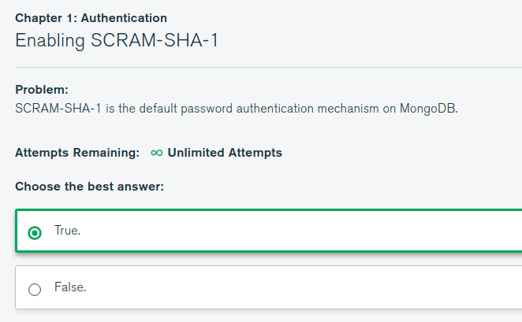

# MongoDB University M310 学习笔记

## 一、身份验证 （Authentication）

### SCRAM-SHA-1 

默认基于用户名密码的身份验证机制。

```js
mongod --auth
mongo
use admin
db.createUser({user: 'smqk', pwd: 'password', roles: ['root']})

db.auth('smqk', 'password');
```

#### 如何启用 SCRAM-SHA-1

- 方式一、启动mongod 传递 --auth 选项即可

- 方式二、配置文件配置启用授权选项

```yaml
security:
    authorization: 'enabled'
```

> 启用身份验证后数据库没有用户可以本地连接 mongo 可以创建一个用户。




### X.509

MongoDB 使用 X.509 证书用于身份验证。

```bash
# mongod --version 查看是否支持 TLS
smqk@lenovo:~/Mongodb DBA/m310/m310-vagrant-env$ mongod --version
db version v4.2.0
git version: a4b751dcf51dd249c5865812b390cfd1c0129c30
OpenSSL version: OpenSSL 1.0.2g  1 Mar 2016
allocator: tcmalloc
modules: none
build environment:
    distmod: ubuntu1604
    distarch: x86_64
    target_arch: x86_64
smqk@lenovo:~/Mongodb DBA/m310/m310-vagrant-env$
```

```bash
mongod --sslMode requireSSL --sslPEMKeyFile server.pem --sslCAFile ca.pem


mongo --ssl --sslPEMKeyFile client.pem --sslCAFile ca.pem
```


- LDAP
- Kerberos