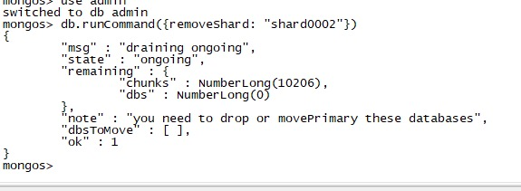
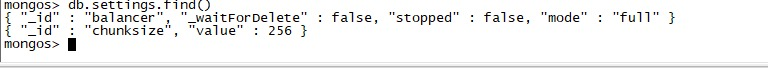

# 删除分片


### 问题产生

已知有多个分片，直接连接分片删除，分片中的数据，然后连接mongos 删除分片一直不成功。







```bash
# 删除分片
db.runCommand( { removeshard: "your_shard_name" } ) 
```


### 解决

```bash
# 分片上数据都没有，这里面的也就是无用的数据，删除掉后然后重新执行删除分片成功
db.chunks.remove({"shard":"your_shard_name"}) 
```


https://blog.csdn.net/liqi_q/article/details/79047361

