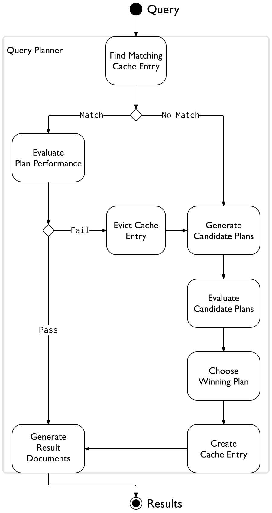

# 查询计划（Query Plans）

 MongoDB 查询优化器处理查询并对查询提供可用的索引选择高效的查询计划。然后，查询系统每次运行查询时都使用此查询计划。

查询优化器仅缓存那些有多个可行计划的 [query shape](https://docs.mongodb.com/v3.4/reference/glossary/#term-query-shape)。

对于每个查询，查询计划程序在查询计划缓存中搜索适合 query shape 的查询计划。如果没有匹配到合适的查询计划，则查询计划程序会生成候选计划，以便在试用期内进行评估。查询计划程序选择获胜计划，创建包含获胜计划的缓存条目，并使用它来生成结果文档。

如果存在匹配条目，则查询计划程序将根据该条目生成计划，并通过重新计划机制评估其性能。 此机制根据计划性能进行通过/失败决策，并保留或逐出缓存条目。 在逐出时，查询计划程序使用常规计划过程选择新计划并对其进行缓存。 查询计划程序执行计划并返回查询的结果文档。

下图阐述查询计划逻辑：

有关触发计划缓存更改的其他方案，请参阅[计划缓存刷新](https://docs.mongodb.com/v3.4/core/query-plans/#query-plans-plan-cache-flushes)。

你可以使用 db.collection.explain() 或 cursor.explain() 方法展示给定查询的查询计划相关统计信息。在制定[索引策略](https://docs.mongodb.com/v3.4/applications/indexes/)时，此信息可以提供帮助。

在2.6版中更改：explain() 操作不再读取或写入查询计划程序缓存。

## 计划缓存刷新（Plan Cache Flushes）

Catalog operations like index or collection drops flush the plan cache.

mongod 重启或关闭计划缓存（会丢失）将不会被留存。

新版本2.6中：MongoDB 提供 [查询计划缓存方法](https://docs.mongodb.com/v3.4/reference/method/js-plan-cache/)显示及修改已缓存的计划。 [PlanCache.clear()](https://docs.mongodb.com/v3.4/reference/method/PlanCache.clear/#PlanCache.clear) 方法刷新所有的计划缓存。用户也可以使用 [PlanCache.clearPlansByQuery()](https://docs.mongodb.com/v3.4/reference/method/PlanCache.clearPlansByQuery/#PlanCache.clearPlansByQuery)清除指定的计划缓存

## 索引过滤器（Index Filters）

索引过滤器确定优化程序为 query shape 评估的索引。query shape 由 query，sort 和 projection 的组合组成。 如果给定 query shape 存在索引过滤器，则优化程序仅考虑过滤器中指定的那些索引。

当 query shape 存在索引过滤器时，MongoDB 会忽略 hint()。查询MongoDB为 query shape 是否使用了索引过滤器，检查 db.collection.explain() 或 cursor.explain() 方法的 [indexFilterSet](https://docs.mongodb.com/v3.4/reference/explain-results/#explain.queryPlanner.indexFilterSet) 字段。

索引过滤器仅影响优化程序评估的索引; 优化器仍然可以选择集合扫描作为给定 query shape 的获胜计划。

索引过滤器在服务器进程的持续时间内存在，并且在关闭后不会保留。 MongoDB还提供了手动删除过滤器的命令。

由于索引过滤器会覆盖优化程序的预期行为以及hint() 方法，因此请谨慎使用索引筛选器。

更多参阅： [planCacheListFilters](https://docs.mongodb.com/v3.4/reference/command/planCacheListFilters/#dbcmd.planCacheListFilters)， [planCacheClearFilters](https://docs.mongodb.com/v3.4/reference/command/planCacheClearFilters/#dbcmd.planCacheClearFilters) 和 [planCacheSetFilter](https://docs.mongodb.com/v3.4/reference/command/planCacheSetFilter/#dbcmd.planCacheSetFilter)。

译文地址： https://docs.mongodb.com/v3.4/core/query-plans/